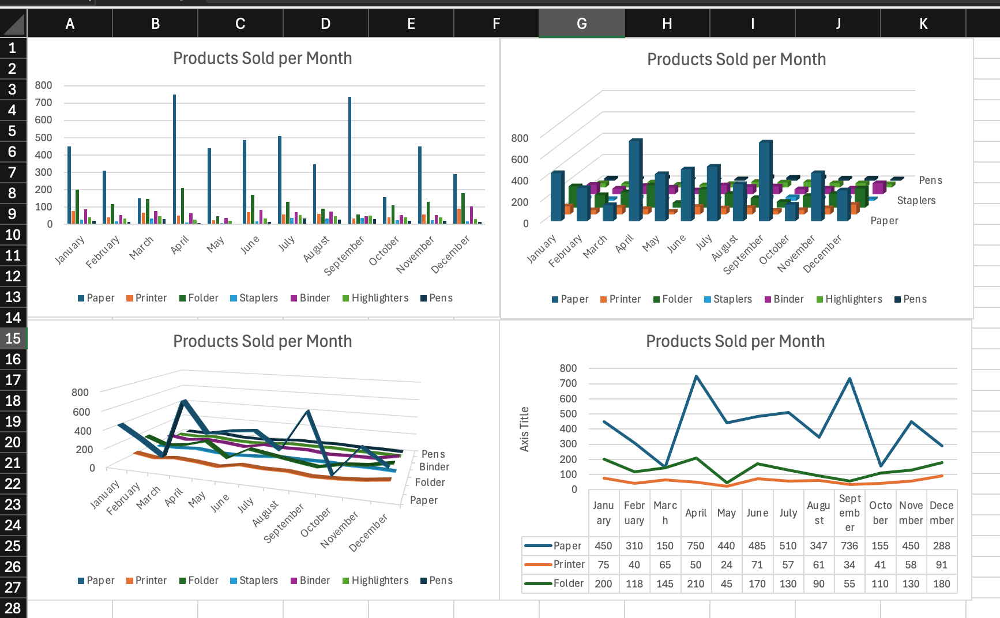
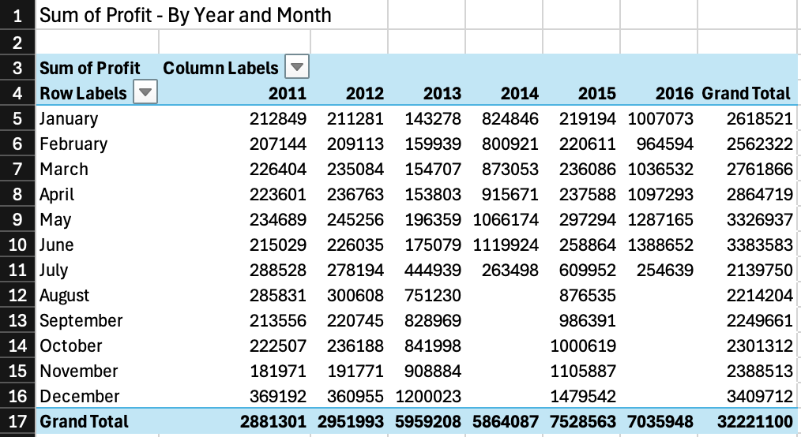
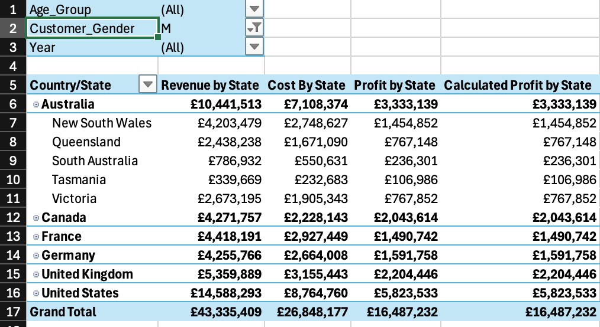
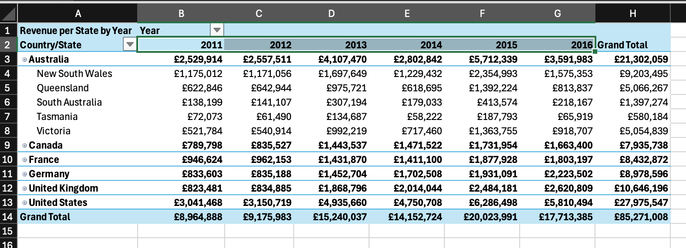
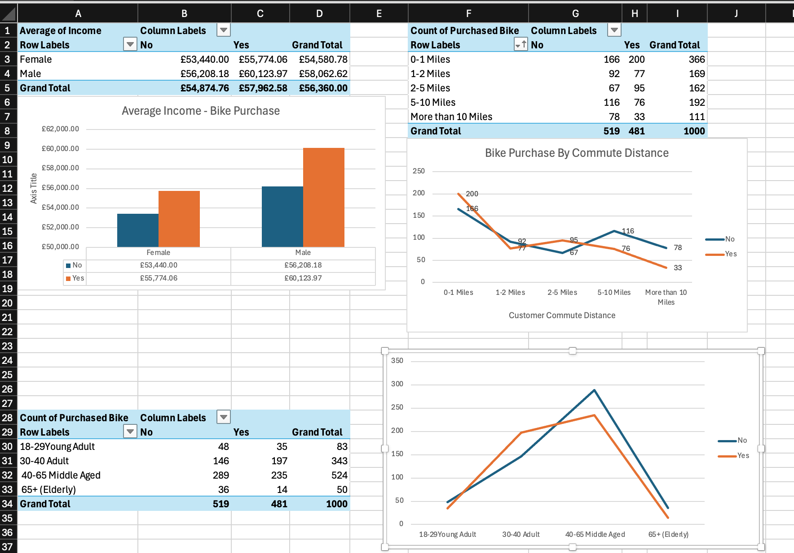
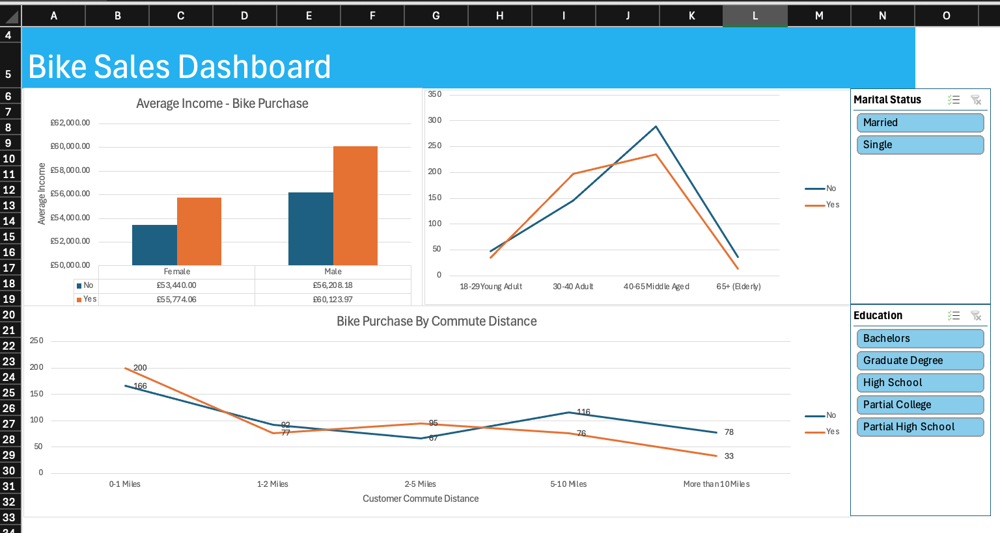

## Project Breakdown

### Chart Data
Chart visualisation of stationary sales.

### Data Cleaning
Data Cleaning of imported raw data of US Presidents including formatting dates and trimming whitespace.

### Formulas
Display of using the excel functions, including:
- LEN, TRIM, CONCAT, RIGHT, LEFT, SUBSTITUTE, SUM, SUMIFS ...

### Pivot Table
Created three pivot tables, with filters on European bike sale data.

Pivot Table 1:

Pivot Table 2:
 
Pivot Table 3:

### Project

A project which entailed creating Pivot tables, charts and a dashboard on bike purchase customer data.

#### Project Images
Pivot Tables and Charts:

Custom Dashboard:

### XLOOKUP
Displaying the use of XLOOKUP, LOOKUP, HORIZONTAL XLOOKUP, VLOOKUP

